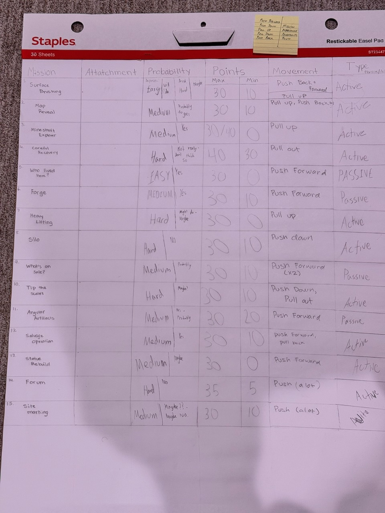
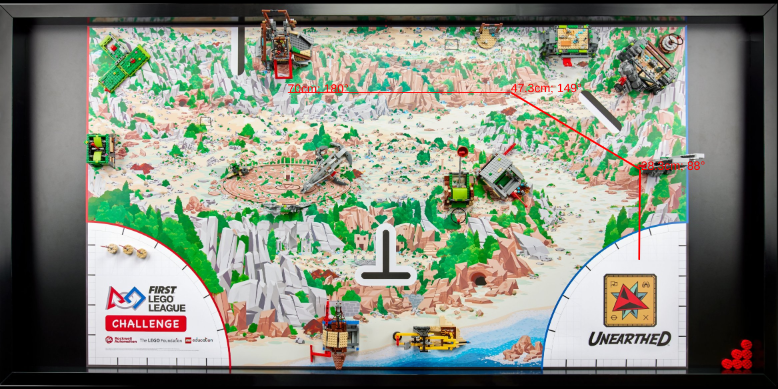
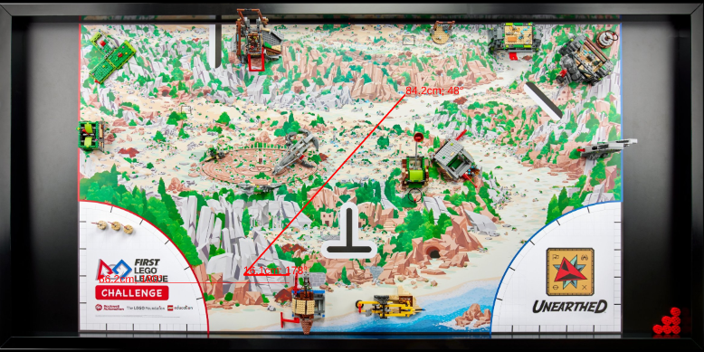

# PantheraTech - 73461-2025
Team **PantheraTech** [`#73461`] for 2025 codebase

## Robot Game 

### Robot Design 

### Robot

### Codebase
The code is under [`/block`](/block) folder. The main program is [**PantheraTech.llsp3**](/block/PantheraTech.llsp3)

### Mission Plans
Based on the list of missions, the team was able to solve and gain up to 300 points, but due to time constraint, they were not able to solve all missions in the stipulated time period.

#### Missions and Types of Attachments 

#### Grand Plan

#### Grand Plan 2 

#### Mission 1, 2 & 11

#### Mission 8 & 3

#### Mission 12 & 9

## Innovation Project

## Qualifiers
The team participated on *Sat 11/22 2025* at [**North NJ - Bridgewater Raritan Brik Rampage Qualifying Event (Bridgewater Raritan Middle School)**](https://eventhub.firstinspires.org/leaderboard/ba8af290-4e72-492e-9bf9-a4381370147e/1103911a-04c7-4d08-a559-3fecce091943) 

### Breakthrough Award
This award celebrates a team that made significant progress in their confidence and capability in at least one of the core areas of FIRST LEGO League.

### Robot Game Scores 
| Rank	| Team Number and Name |	High Score |	Match 1 |	Match 2 |	Match 3 |
|---|---|---|---|---|---|
| 12 | 73461 - PantheraTech | 210 | 170 | 190 | 210 |

### Final Total Scores
TBD 
